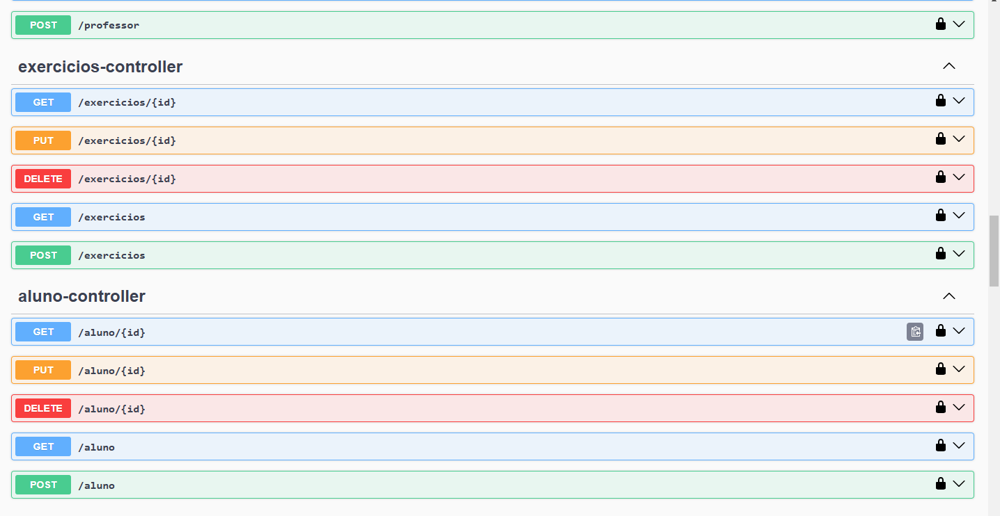
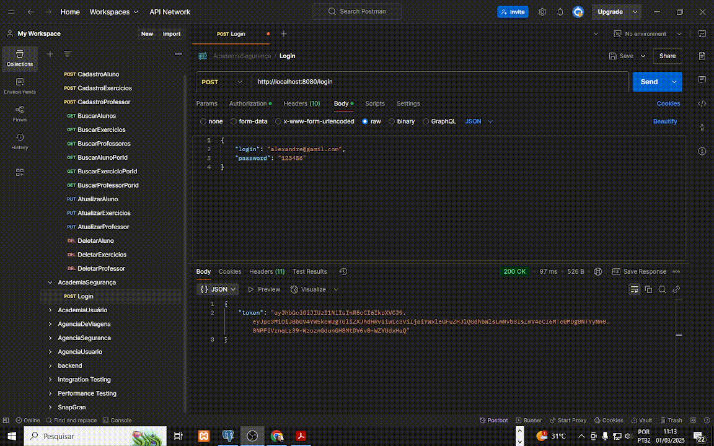

# API Academia

 

## Descrição

API desenvolvida para gerenciar uma academia de musculação. A aplicação permite o cadastro, consulta, atualização e exclusão de alunos, professores, exercícios e usuários, além de fornecer autenticação segura via JWT (JSON Web Token).


> 

---

## Funcionalidades

### Alunos
- Cadastro de novos alunos.
- Listagem paginada de alunos.
- Consulta de aluno por ID.
- Atualização de dados de um aluno.
- Exclusão de um aluno.

### Professores
- Cadastro de novos professores.
- Listagem paginada de professores.
- Consulta de professor por ID.
- Atualização de dados de um professor.
- Exclusão de um professor.

### Exercícios
- Cadastro de novos exercícios.
- Listagem paginada de exercícios.
- Consulta de exercício por ID.
- Atualização de dados de um exercício.
- Exclusão de um exercício.

### Usuários
- Cadastro de novos usuários.
- Autenticação via JWT.

---

## Tecnologias Utilizadas

- **Linguagem**: Java 17
- **Framework**: Spring Boot 3.4.2
- **Segurança**: Spring Security, JWT
- **Banco de Dados**: PostgreSQL
- **Migração de Banco de Dados**: Flyway
- **Documentação da API**: Swagger/OpenAPI
- **Outras Ferramentas**: Lombok, ModelMapper, Maven

---

## Estrutura do Projeto

```
src/
├── main/
│   ├── java/com/academia/academia/
│   │   ├── config/          # Configurações globais (segurança, filtros, etc.)
│   │   ├── controller/      # Controladores REST
│   │   ├── dto/             # DTOs para transferência de dados
│   │   ├── model/           # Entidades do banco de dados
│   │   ├── repository/      # Interfaces de repositório
│   │   ├── service/         # Lógica de negócio
│   │   └── AcademiaApplication.java # Classe principal
│   └── resources/
│       ├── db/migration/    # Scripts SQL de migração
│       └── application.yml  # Configurações da aplicação
└── test/                    # Testes unitários e de integração
```

---

## Configuração e Execução

### Pré-requisitos

- Java 17
- Maven
- PostgreSQL

### Passos para Executar

1. Clone o repositório:
   ```bash
   git clone https://github.com/AlexandreLiberatto/api-academia.git
   ```

2. Configure o banco de dados no arquivo `application.yml`:
   ```yaml
   spring:
     datasource:
       url: jdbc:postgresql://localhost:5432/nome-do-banco
       username: seu-usuario
       password: sua-senha
     jpa:
       hibernate:
         ddl-auto: none
       show-sql: true
   ```

3. Execute a aplicação:
   ```bash
   mvn spring-boot:run
   ```

4. Acesse a API em `http://localhost:8080`.

---

## Endpoints da API

### Documentação Interativa (Swagger)
Acesse a documentação interativa da API através do Swagger:
[Swagger UI](http://localhost:8080/swagger-ui/index.html)

> _Insira aqui uma captura de tela do Swagger._
> 

---

### Login

- **URL**: `/login`
- **Método**: `POST`
- **Descrição**: Realiza a autenticação do usuário e retorna um token JWT.
- **Requisição**:
  ```json
  {
    "login": "usuario",
    "password": "senha"
  }
  ```
- **Resposta**:
  ```json
  {
    "token": "eyJhbGciOiJIUzI1NiIsInR5cCI6IkpXVCJ9..."
  }
  ```

---

### Alunos

#### Cadastrar Aluno
- **URL**: `/aluno`
- **Método**: `POST`
- **Descrição**: Cadastra um novo aluno.
- **Requisição**:
  ```json
  {
    "nome": "João Silva",
    "email": "joao@example.com",
    "plano": "MENSAL"
  }
  ```
- **Resposta**:
  ```json
  {
    "id": 1,
    "nome": "João Silva",
    "email": "joao@example.com",
    "plano": "MENSAL"
  }
  ```

#### Listar Alunos
- **URL**: `/aluno`
- **Método**: `GET`
- **Descrição**: Retorna uma lista paginada de alunos.

---

### Professores

#### Cadastrar Professor
- **URL**: `/professor`
- **Método**: `POST`
- **Descrição**: Cadastra um novo professor.
- **Requisição**:
  ```json
  {
    "nome": "Maria Souza",
    "email": "maria@example.com",
    "especialidade": "MUSCULACAO"
  }
  ```
- **Resposta**:
  ```json
  {
    "id": 1,
    "nome": "Maria Souza",
    "email": "maria@example.com",
    "especialidade": "MUSCULACAO"
  }
  ```

---

### Exercícios

#### Cadastrar Exercício
- **URL**: `/exercicios`
- **Método**: `POST`
- **Descrição**: Cadastra um novo exercício.
- **Requisição**:
  ```json
  {
    "nome": "Supino Reto",
    "grupoMuscular": "PEITO"
  }
  ```
- **Resposta**:
  ```json
  {
    "id": 1,
    "nome": "Supino Reto",
    "grupoMuscular": "PEITO"
  }
  ```

---

### Usuários

#### Cadastrar Usuário
- **URL**: `/usuario`
- **Método**: `POST`
- **Descrição**: Cadastra um novo usuário.
- **Requisição**:
  ```json
  {
    "login": "usuario",
    "password": "senha"
  }
  ```
- **Resposta**:
  ```json
  {
    "id": 1,
    "login": "usuario"
  }
  ```

---

## Autenticação e Autorização

A API utiliza autenticação via JWT. Após realizar o login no endpoint `/login`, inclua o token retornado no cabeçalho `Authorization` das requisições subsequentes:

```http
Authorization: Bearer <token>
```

---

## Contribuição

Contribuições são bem-vindas! Para contribuir:

1. Faça um fork do repositório.
2. Crie uma branch para sua feature (`git checkout -b feature/nova-funcionalidade`).
3. Faça commit das suas alterações (`git commit -m 'Adiciona nova funcionalidade'`).
4. Envie para o repositório remoto (`git push origin feature/nova-funcionalidade`).
5. Abra um pull request.

---

## Licença

Este projeto está sob a licença [MIT](LICENSE).

---

## Contato

- **E-mail**: [alexandreliberatto@gmail.com](mailto:alexandreliberatto@gmail.com)
- **WhatsApp**: [48 99160-4054](https://wa.me/5548991604054)
- **Portfólio**: [Portfolio](https://portfolio-3-d-olive.vercel.app/)
- **LinkedIn**: [Alexandre Liberato](https://www.linkedin.com/in/alexandre-liberato-32179624b/)
- **GitHub**: [AlexandreLiberatto](https://github.com/AlexandreLiberatto)

---

> 

---

